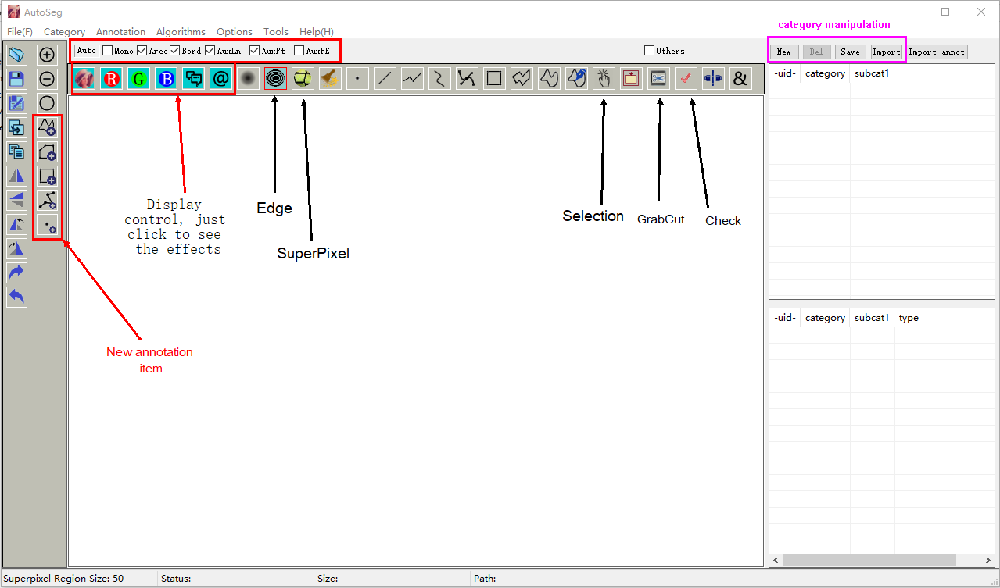
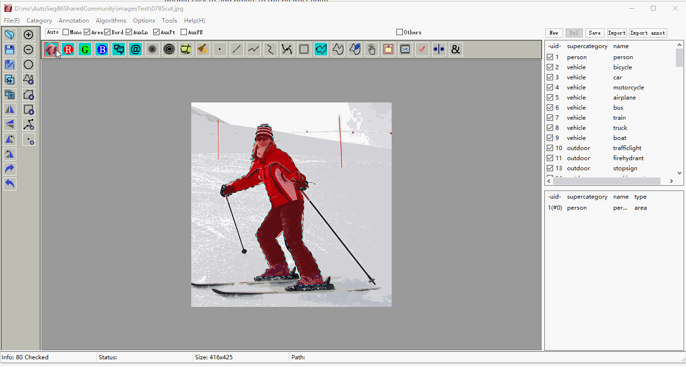

# NOTE: AutoSeg Professional is available for downloading

https://github.com/SpaceView/AutoSegProfessional

which has far more functionalities.  
I developed this software tools in 2018, for segment annotation it still has the highest accuracy as far as I know.
The segmentation tutorial is at
https://github.com/SpaceView/AutoSegProfessional/tree/main/tutorial_AutoEdge_AutoSeg
Please read the tutorials before you start your work.

  
# Introduction to AutoSeg -- an image annotation tool

Attension: the tool doesn't accept path with special characters, such as Chinese characters.

For latest updating information please refer to <ReleaseNotice.txt>

# Introduction
Easy and user friendly annotation tool, it supports area annotation, polygon annotation, rectangle annotation. 

Annotation of landmarks & points are not available yet.

You may extract imagesTest.7z anywhere in your disk and start testing.

Functions overview are given as follows,

In processing of marking, single click to add points, and double click to finish the polygon or spline areas, etc.

After you finished the marking, you may edit the polygon,

1. double click to add points to the nearest edge
2. right click to delete extra points

When the polygon is acceptable, click the check button (or press the carriage return button on your keyboard) to accept it and convert it to annotation.

The annotation files are saves as json format, mainly coco format, you need a category file for all annotations.
For Area Annotation, it is binary RLE code, the same as coco json rules.
If you need c++ code for your application, please check the mask-api files for detail, please note our mask-api has updated to support both horizontal and vertical scanlines, while coco-api only supports vertical scanlines.

We are now still updating the program, it will support PNG masks, binary masks, and continue to support RLE binary mask(json format);
The program will also include more automatical speedy tools for annotation.

Different from coco format (2 level), Autoseg accepts multiple levels of annotation, you may check the menu category->setup to see the results.

Some functions (left row buttons) are planned but not finished yet, luckily these are functions not frequently used.

You can play with functions of superpixels or cannyedge, these functions are a little bit complicated to use, but easy to understand. I just give the demo of using it.

The "Delete" function is given as follows, you make a selection with polygon, polyspline, or manual draw button, when press the del key on your keyboard, any selected area inside will be marked as background.

You may read the about-> help if you have comments or requirements about these annotation tool.

Categories should be carefully manipulated, so some enabling/disabling functions are added,  as below

[CategoryManipulation.gif]

## Automatic Saving

This function is specially design to speed up your annotation. 

The annotations will be saved for you when you click next or previous button, so no time will be wasted when you move on to the next image.

Below you can see that the saving box popups only once for the destination folder of the annotations, 

[please download the **AutoSaving.gif** to your computer for a preview].

## General short key

A/a -- auto smart mode
F/f -- foreground mode
B/b -- background mode

carriage return-- accept/transfer current results to annotation

escape - - reset all conditions

## Donation

We will keep updating this software, any advice are welcome.

## About us

SpaceSoftwares is a team focused on high accuracy computer vision application. Here we target to provide the highest accuracy in semantic segmentation to auto-driving, medical imaging, general machine learning, tracking, automation, etc.;

We focusing on accuracy improvements,  our AI models are widely applied to industrial applications such as  precision positioning system, defect detection, classification, etc..

For anything please contact us [tansheng@spacesoftwares.com](mailto:tansheng@spacesoftwares.com)
