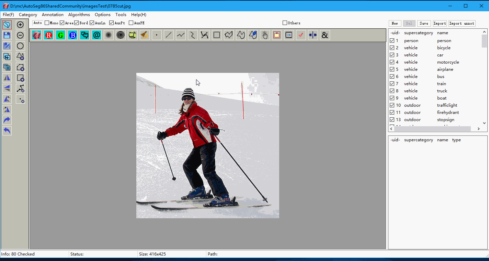

# Introduction to AutoSeg -- an image annotation tool

Easy and user friendly annotation tool, it supports area annotation, polygon annotation, rectangle annotation. 

Landmarks & points are not finished yet.

You may extract imagesTest.7z anywhere in your disk and start testing.

Functions overview are given as follows,

In processing of marking, single click to add points, and double click to finish the polygon or spline areas, etc.

After you finished the marking, you may edit the polygon,

1. double click to add points to the nearest edge
2. right click to delete extra points

When the polygon is acceptable, click the check button (or press the carriage return button on your keyboard) to accept it and convert it to annotation.

The annotation files are saves as json format, mainly coco format, you need a category file for all annotations.

Different from coco format (2 level), Autoseg accepts multiple levels of annotation, you may check the menu category->setup to see the results.

Some functions (left row buttons) are planned but not finished yet, luckily these are functions not frequently used.

You can play with functions of superpixels or cannyedge, these functions are a little bit complicated to use, but easy to understand. I just give the demo of using it.

The "Delete" function is given as follows, you make a selection with polygon, polyspline, or manual draw button, when press the del key on your keyboard, any selected area inside will be marked as background.

You may read the about-> help if you have comments or requirements about these annotation tool.

### General short key

A/a -- auto smart mode
F/f -- foreground mode
B/b -- background mode

carriage return-- accept/transfer current results to annotation

escape - - reset all conditions

### About us

SpaceSoftwares is a team focused on high accuracy image annotation and image segmentation, we target and provide the highest accuracy in semantic segmentation or panoptical segmentation, for auto-driving, general machine learning, tracking, automation; and, we also provide high quality image matting for media, advertisement posts, movies, etc.

We are at your service, for anything please contact us [tansheng@spacesoftwares.com](mailto:tansheng@spacesoftwares.com)
